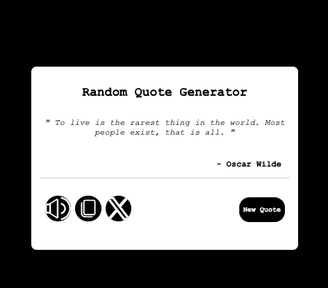

# projects 
# Random Generator Quote 
------------------------------------------------------------------------------------------------------------------

0. **Predefined quotes** 
This program allows users to generate random quotes with the click of a button. Additionally, there are three buttons, each serving a unique function:

1. **Text-to-Speech Functionality**:
The first button reads aloud the quote and the author's name using the SpeechSynthesisUtterance() API, providing a seamless audio experience.

2. **Copy to Clipboard**:
The second button enables users to copy the quote text directly from the DOM by invoking the method:
navigator.clipboard.writeText(fullText);

3. **Share on Twitter**:
The third button opens a new Twitter page, making it easy to share the quote with just one click.

4. **Data Validation**
Ensures that no quote is repeated consecutively when generating new quotes.

5. **Thankyou message**
Displays a thank-you message to the user after successfully copying a quote to the clipboard.

------------------------------------------------------------------------------------------------------------------

**TECHNOLOGIES USED**
- html5: structured and semantic layout.
- CSS3: Syled with a modern, clean design, including hover and tranition effects. 
- JavaScript(ES6): DOM manipulation and API usage for interactivity. 

------------------------------------------------------------------------------------------------------------------

**PROJECT STRUCTURE**
RandomGeneratorQuote/
│
├── index.html          # Main HTML file
├── style.css           # Styling for the application
├── script.js           # JavaScript functionality
├── assets/             # Folder containing all assets
│   ├── volume.svg      # Sound icon
│   ├── clipboard.svg   # Copy icon
│   ├── twitter.svg     # Twitter icon
│   └── screen.png      # Screenshot for the README
└── README.md           # Documentation

------------------------------------------------------------------------------------------------------------------

**HOW TO USE**

1.Clone the Repository
- git clone https://github.com/DavideSchirru17/projects

2. Open the project 
- Navigate to the project folder and open index.html in your browser 

3. Interact with the App 
- Click the New quote button to generate a random quote. 
- Use the Sound Icon to listen to the quote. 
- Click the Copy Icon to copy the quote to your clipboard. 
- Share the quote on Twitter using the Twitter Icon. 

------------------------------------------------------------------------------------------------------------------

 **Future Enhancements**

- Integrate an external API to fetch real-time quotes.
- Add more customization options, such as themes and font styles.
- Implement user-generated quotes with local storage.

------------------------------------------------------------------------------------------------------------------
 **License**
This project is licensed under the JUST IT license. You are free to use and modify it for personal purposes. 

